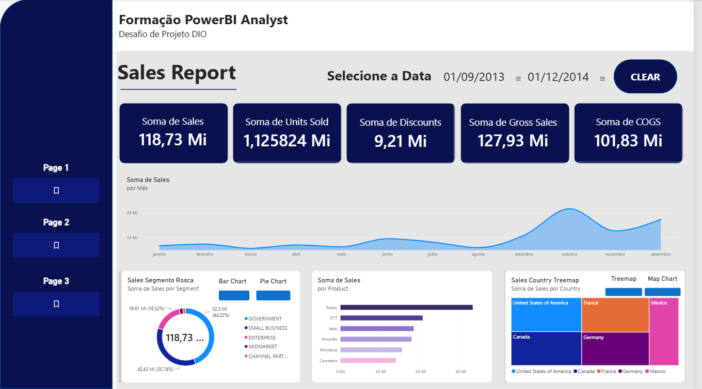
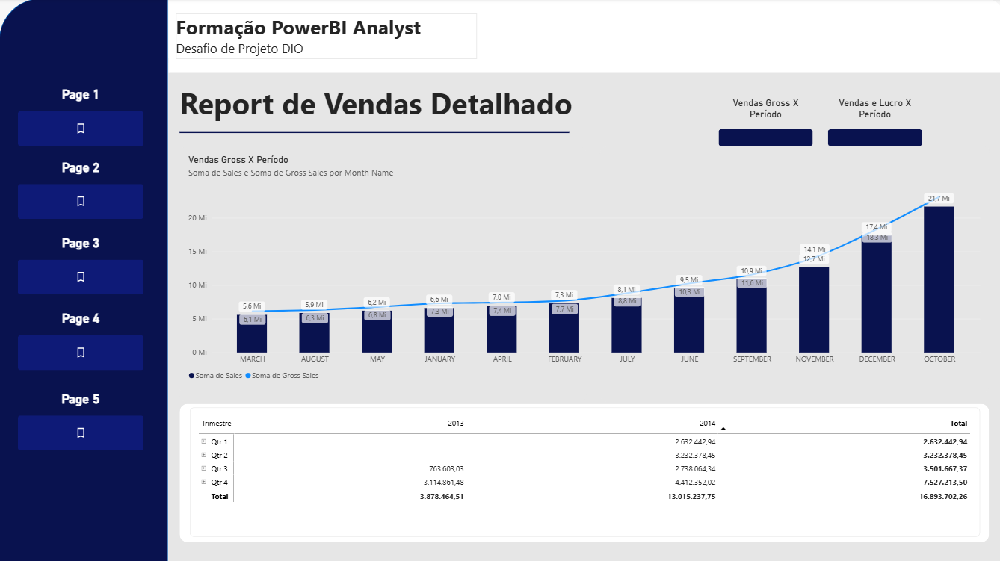
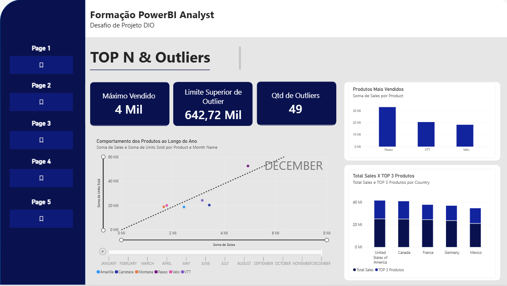
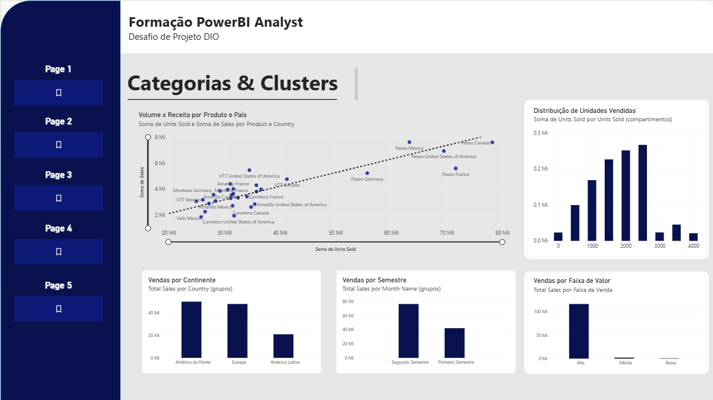
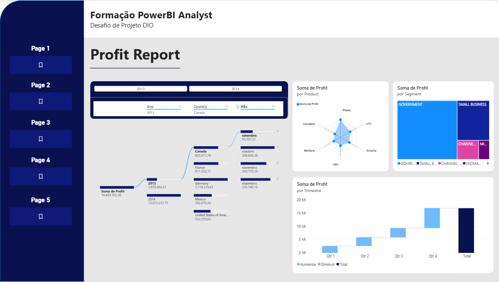

# 📊 Relatório Financials | Power BI

> Relatório interativo construído sobre a base **sample financials** do Power BI, com menu de navegação persistente, indicadores, visuais alternáveis e análise estatística — em cinco páginas.



---

## 📌 Sobre o projeto

Projeto desenvolvido ao longo de dois desafios da [DIO](https://www.dio.me), na Formação Power BI Analyst:

| Desafio | O que acrescentou |
|---|---|
| **Criando um Relatório Gerencial com Power BI** | A estrutura de páginas, os indicadores que alternam visuais e os segmentadores com imagem |
| **Atualizando Relatório Financeiro com Foco na Experiência do Usuário** | O redesenho visual, o menu de navegação em todas as páginas e a terceira página analítica |
| **Explorando Dados com Analytics, Segmentação e DAX** | As páginas 4 e 5 — outliers por desvio padrão, TOP N, agrupamentos e medidas DAX |

A proposta do primeiro era ir além de um relatório simples: construir uma estrutura de páginas definida, com navegabilidade por botões, segmentadores com imagem associada e indicadores que permitem alternar entre diferentes visuais sobre um mesmo assunto.

O segundo manteve toda essa base e atacou a **experiência de quem lê** — como a informação se posiciona na tela, como o olho é guiado, e como a navegação deixa de ser um botão solto para virar um menu presente em qualquer ponto do relatório.

---

## 🎨 A atualização de experiência do usuário

O desafio propõe quatro princípios. O que cada um mudou aqui:

**Posicionamento.** Os indicadores saíram de posições dispersas e passaram a ocupar a faixa superior da área de conteúdo, onde o olho chega primeiro. Abaixo deles vem a evolução temporal, e só então o detalhamento por categoria — do agregado ao específico, de cima para baixo.

**Contraste.** A faixa lateral em azul-marinho profundo contra a área de conteúdo clara separa navegação de informação sem precisar de bordas ou títulos explicando o que é o quê. Os cards de indicadores repetem o mesmo marinho, o que os amarra visualmente ao menu e os destaca do fundo claro.

**Proporção áurea.** A divisão entre a faixa de navegação e a área de conteúdo, e entre a faixa de indicadores e os gráficos abaixo dela, segue proporções aproximadamente áureas em vez de metades iguais. O resultado é um layout que não parece dividido ao meio — parece composto.

**Segmentação dos dados.** Na página 1, o filtro de período ficou junto do título, com um botão **CLEAR** ao lado para desfazer a seleção sem procurar onde clicar. Na página 2, os segmentadores de ano ganharam destaque próprio no canto superior esquerdo, antes dos visuais que eles controlam.

> Como o próprio desafio observa, não são regras rígidas. Alguns visuais rompem a grade de propósito — é o que evita que o relatório fique simétrico demais e, por consequência, sem hierarquia.

---

## 🧭 Menu de navegação

Cada página tem o mesmo menu na faixa lateral esquerda, com botões de **Page 1** a **Page 5**. Estar sempre no mesmo lugar é o que torna a navegação previsível: o leitor não procura como sair de onde está.

Os botões usam os três estados que o Power BI oferece, e cada um comunica uma coisa diferente:

| Estado | Quando aparece | O que comunica |
|---|---|---|
| **Padrão** | Em repouso | Destino disponível |
| **Focalizar** | Ao passar o mouse | "Este é clicável" |
| **Selecionado** | Na página atual | "Você está aqui" |

A ação de cada botão é **Navegação de Página**.

---

## 📁 Estrutura do relatório

### Página 1 — Sales Report

Painel executivo com os indicadores do negócio e visuais alternáveis.

| Elemento | Descrição |
|---|---|
| Cards de indicadores | Sales, Units Sold, Discounts, Gross Sales e COGS |
| Segmentador de data | Intervalo de período no topo, com botão **CLEAR** para limpar a seleção |
| Gráfico de área | Evolução de Sales ao longo dos meses |
| Gráfico de barras | Soma de Sales por Product |
| Visual alternável — segmento | Rosca ou barras, pelos botões *Pie Chart* e *Bar Chart* |
| Visual alternável — país | Treemap ou mapa, pelos botões *Treemap* e *Map Chart* |
| Menu lateral | Navegação para as páginas 2 e 3 |

### Página 2 — Profit Report

Página de aprofundamento, com visuais analíticos e customizados.

| Elemento | Descrição |
|---|---|
| Segmentadores de ano | 2013 e 2014, em destaque antes dos visuais |
| Segmentadores de dimensão | Ano, Country e Mês |
| Árvore hierárquica | Decomposição do lucro por dimensões (Decomposition Tree) |
| Gráfico radar | Soma de Profit por Product (visual customizado) |
| Treemap | Soma de Profit por Segment |
| Gráfico cascata | Composição do lucro por trimestre (Waterfall) |
| Menu lateral | Navegação para as páginas 1 e 3 |

### Página 3 — Report de Vendas Detalhado

Página criada no desafio de experiência do usuário, com foco em leitura temporal e detalhamento tabular.

| Elemento | Descrição |
|---|---|
| Gráfico combinado | Soma de Sales em colunas e Soma de Gross Sales em linha, por mês, com rótulos de dados |
| Visual alternável | Botões *Vendas Gross X Período* e *Vendas e Lucro X Período* trocam a métrica comparada |
| Matriz de vendas | Trimestre nas linhas, ano nas colunas, com subtotais e total geral, expansível por hierarquia |
| Menu lateral | Navegação para as páginas 1 e 2 |



### Página 4 — TOP N & Outliers

Página estatística. Em vez de mostrar o total, procura o que foge do total: os produtos que concentram a receita e as vendas que destoam do comportamento médio.

| Elemento | Descrição |
|---|---|
| Cards de estatística | Máximo Vendido, Média de Vendas, Desvio Padrão de Vendas, Limite Superior de Outlier e Qtd de Outliers |
| Filtro N Principais | Aplicado no visual, limita a exibição aos produtos de maior receita |
| Gráfico de dispersão | Com **Eixo de Reprodução**, animando a evolução dos pontos ao longo do tempo |
| Linha de tendência | Adicionada pelo painel **Análise**, revelando a direção geral da relação |
| Medidas DAX | `Ranking de Produto` e `TOP 3 Produtos` |

O critério de outlier adotado é **média + 2 desvios padrão**. Vendas acima desse limite são tratadas como atípicas — não erradas, mas raras o bastante para merecerem leitura separada da média.



### Página 5 — Categorias & Clusters

Página de segmentação. A mesma base é recortada de quatro maneiras diferentes, cada visual demonstrando um tipo distinto de agrupamento.

| Elemento | Descrição | Tipo de segmentação |
|---|---|---|
| Volume x Receita por Produto e País | Dispersão com `Units Sold` em X e `Sales` em Y, com linha de tendência | Granularidade por `Valores` |
| Distribuição de Unidades Vendidas | Histograma: contagem de vendas por faixa de 500 unidades | Compartimentos (binning numérico) |
| Vendas por Continente | `Country (grupos)` — América do Norte, Europa e América Latina | Agrupamento de lista |
| Vendas por Semestre | `Month Name (grupos)` — Primeiro e Segundo Semestre | Agrupamento de período |
| Vendas por Faixa de Valor | `Faixa de Venda` — Alta, Média e Baixa | Coluna calculada em DAX |
| Segmentador | `Segment (grupos)` filtrando a página inteira | Agrupamento de lista |

O histograma usa **contagem** no eixo Y, não soma. Com soma, uma faixa maior naturalmente acumularia mais unidades e o gráfico só repetiria o óbvio; com contagem, ele mostra frequência — quantas vendas se parecem entre si. O perfil que aparece é assimétrico: a maioria das vendas é de volume pequeno a médio, e as de volume alto são poucas. São exatamente os pontos isolados à direita do gráfico de dispersão da mesma página.



---

## 🧮 Medidas e colunas DAX

```dax
Total Sales = SUM(financials[Sales])

Máximo Vendido = MAX(financials[Units Sold])

Média de Vendas = AVERAGE(financials[Sales])

Desvio Padrão de Vendas = STDEV.P(financials[Sales])

Limite Superior de Outlier = [Média de Vendas] + 2 * [Desvio Padrão de Vendas]

Qtd de Outliers =
VAR Limite = [Limite Superior de Outlier]
RETURN COUNTROWS(FILTER(financials, financials[Sales] > Limite))

Ranking de Produto =
RANKX(ALLSELECTED(financials[Product]), [Total Sales], , DESC)

TOP 3 Produtos =
VAR Top3 = TOPN(3, ALLSELECTED(financials[Product]), [Total Sales], DESC)
RETURN CALCULATE([Total Sales], KEEPFILTERS(Top3))
```

Coluna calculada:

```dax
Faixa de Venda =
SWITCH(TRUE(),
    financials[Sales] >= 20000, "Alta",
    financials[Sales] >= 5000,  "Média",
    "Baixa")
```

Duas decisões de implementação valem o registro:

**O `VAR` em `Qtd de Outliers` não é estética.** Sem ele, `[Limite Superior de Outlier]` seria reavaliado a cada linha dentro do `FILTER`, e o resultado mudaria de significado — passaria a comparar cada venda contra um limite recalculado no contexto dela mesma. A variável congela o limite uma vez, no contexto da página, que é o comportamento pretendido.

**`TOP 3 Produtos` usa `TOPN` + `KEEPFILTERS`, não `RANKX`.** Uma medida baseada em ranking só devolve o valor certo quando `Product` está no visual, porque depende do contexto de linha para saber qual produto ranquear. A versão com `TOPN` monta a tabela dos três primeiros e filtra por ela, então funciona igual dentro de um gráfico por produto ou isolada num card.

---

## ⚪ Indicadores e visuais alternáveis

O relatório usa **indicadores (bookmarks)** acionados por botões, permitindo ver o mesmo assunto sob diferentes perspectivas sem sair da página nem perder o contexto dos filtros aplicados:

| Botão | Visual exibido | Página |
|---|---|---|
| Pie Chart | Gráfico de rosca por segmento | 1 |
| Bar Chart | Gráfico de barras por segmento | 1 |
| Treemap | Treemap por país | 1 |
| Map Chart | Mapa geográfico por país | 1 |
| CLEAR | Limpa a seleção e restaura o estado inicial | 1 |
| Vendas Gross X Período | Sales e Gross Sales por mês | 3 |
| Vendas e Lucro X Período | Sales e Profit por mês | 3 |

---

## 🗄️ Base de dados

Base **financials** (amostra oficial do Power BI), com as dimensões e métricas:

- **Dimensões:** Country, Product, Segment, Date (com hierarquia de Ano, Trimestre, Mês e Dia)
- **Métricas:** Sales, Gross Sales, Profit, COGS, Units Sold, Discounts

Arquivos de dados disponíveis em: [julianazanelatto/power_bi_analyst](https://github.com/julianazanelatto/power_bi_analyst)

---

## 🖼️ Visuais customizados

Importados do AppSource:

- **Chiclet Slicer** — segmentador em formato de botões com imagem
- **Radar Chart** — comparativo em teia

Ao abrir o arquivo, o Power BI Desktop carrega esses visuais automaticamente.

---

## 📂 Arquivos

```
powerbi-relatorio-financials/
├── README.md
├── Relatorio_Financials.pbix
├── pagina-1.png
├── pagina-2.png
├── pagina-3.png
├── pagina-4.png
└── pagina-5.png
```

[⬇️ Baixar o arquivo .pbix](Relatorio_Financials.pbix)



---

## 🚀 Como abrir

1. Baixe e instale o [Power BI Desktop](https://powerbi.microsoft.com/pt-br/desktop/) (gratuito).
2. Baixe o arquivo `Relatorio_Financials.pbix` deste repositório.
3. Abra o arquivo. Os visuais customizados são carregados junto com o relatório.

---

## 🛠️ Recursos aplicados

- Estrutura de cinco páginas com layout definido em 1920x1080
- Menu de navegação lateral replicado em todas as páginas
- Botões com estados de **padrão**, **focalizar** e **selecionado**
- Indicadores (bookmarks) para alternar visuais sem trocar de página
- Segmentadores de data, de dimensão e chiclet slicer com imagem
- Matriz com hierarquia de tempo e subtotais
- Gráfico combinado de colunas e linha
- Visuais customizados do AppSource
- Composição de layout por formas, faixas de cor e caixas de texto
- Princípios de posicionamento, contraste, proporção áurea e segmentação
- Filtro **N Principais** aplicado em nível de visual
- **Eixo de Reprodução** para evolução temporal animada
- **Linha de tendência** pelo painel Análise
- Agrupamentos de lista, de período e por compartimentos numéricos
- Medidas e colunas calculadas em DAX para ranking, outliers e faixas de valor

---

## 👨‍💻 Autor

**Antônio Leite Pagnano**
